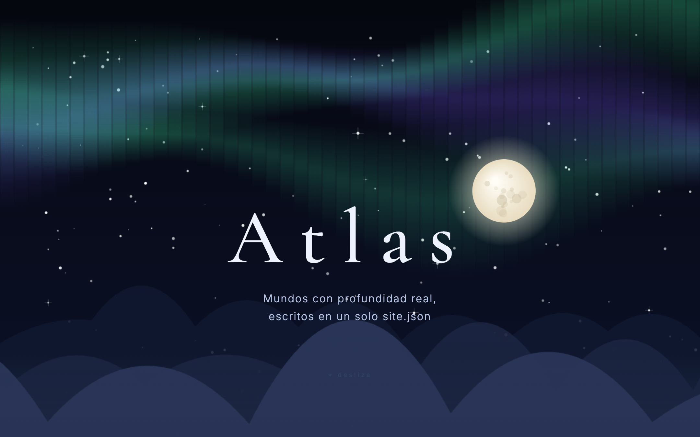
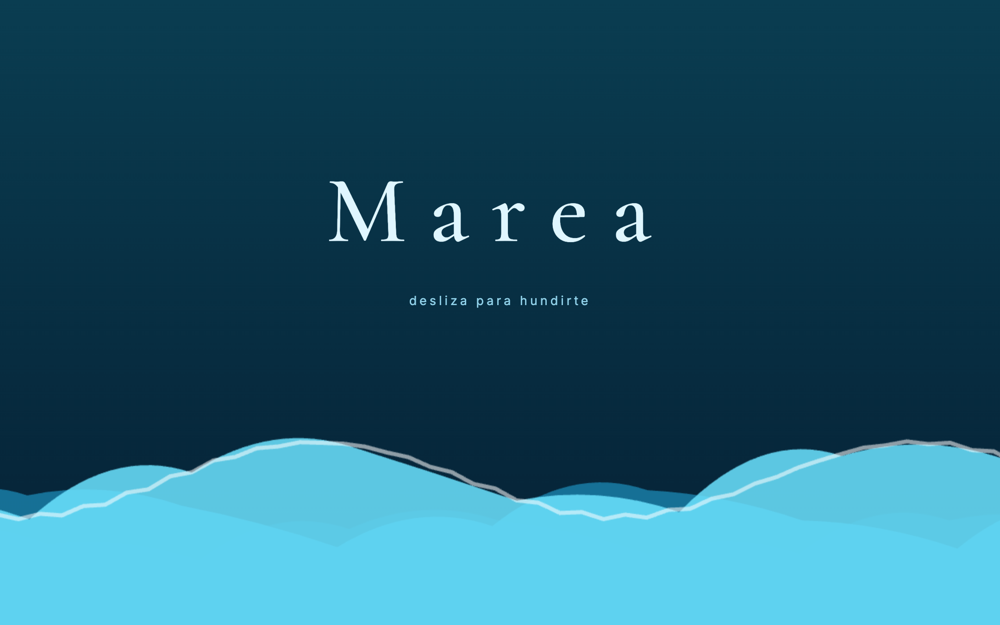
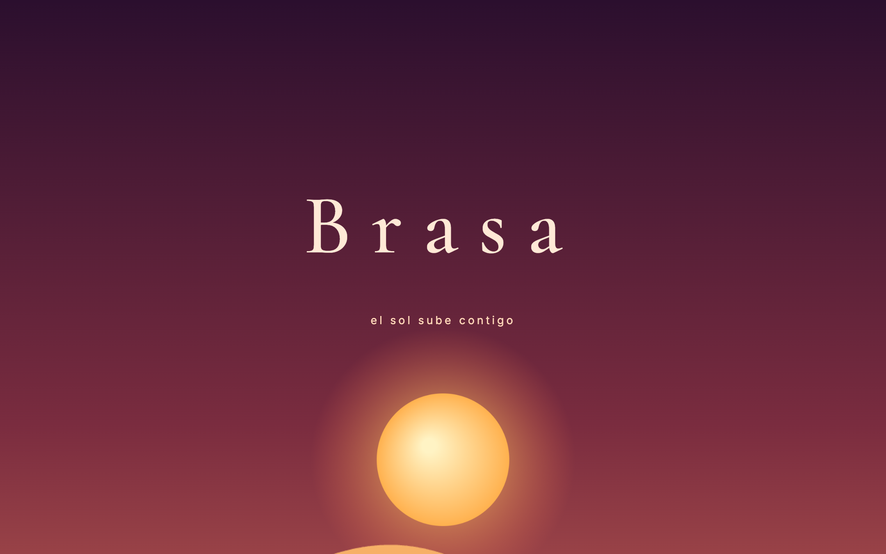

# Atlas — a `linked-home` Parallax Engine showcase

**Live:** https://parallax-editor.github.io/demo-atlas/

A demo portfolio built entirely with [Parallax Engine](https://github.com/parallax-editor/parallax-engine)'s
`linked-home` preset: a public, engine-editable home at `/` that links out to
immersive worlds (`/marea`, `/brasa`) with **in-engine cross-fade navigation** —
no page reload, no router remount.

| Home | Marea | Brasa |
|---|---|---|
|  |  |  |

## What this demonstrates

- **Everything is content.** Each page is a `content/<slug>/site.json` conforming
  to the engine schema (v1.1) — sections, depth layers, scroll/mouse parallax,
  enter/loop/hover animations, split-text titles, Google Fonts, theme tokens.
  No custom Vue components, no page code.
- **`linked-home` preset.** The engine's Nuxt module scans `content/`, prerenders
  `/` + every `/<slug>`, wires SSR fonts + OG meta, emits `robots.txt` (Allow),
  `sitemap.xml` and a `200.html` SPA fallback. This repo has exactly three code
  files: `nuxt.config.ts`, `app.vue`, `package.json`.
- **`link.site` navigation.** The cards on the home and the "volver" links are
  plain elements with `link.site` — the engine cross-fades between worlds and
  keeps the URL in sync via `history.pushState`.
- **Procedural art.** Every PNG (aurora, moon, mountain ridges, jellyfish,
  dunes…) was generated with plain `<canvas>` — no stock assets.

## Run it

```bash
yarn install
yarn dev        # http://localhost:3000
yarn test       # schema + asset validation for every site.json
yarn generate   # static build → .output/public
```

## Deploy

Pushing to `main` triggers `.github/workflows/pages.yml`: validate → generate
with `NUXT_APP_BASE_URL=/demo-atlas/` → publish to GitHub Pages.
`scripts/patch-sitehost-baseurl.mjs` is a temporary shim (until the engine ships
first-class `app.baseURL` support) that keeps in-engine navigation URLs anchored
under the repo subpath.

## Sibling demo

The other workspace preset — private, per-URL invitation sites — lives at
[demo-invites](https://github.com/parallax-editor/demo-invites).

## License

GPL-3.0-or-later, same as the engine.
